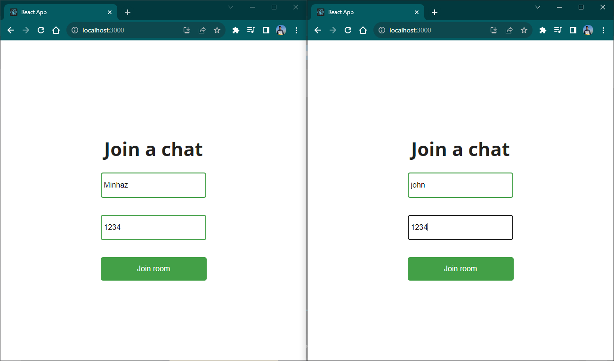
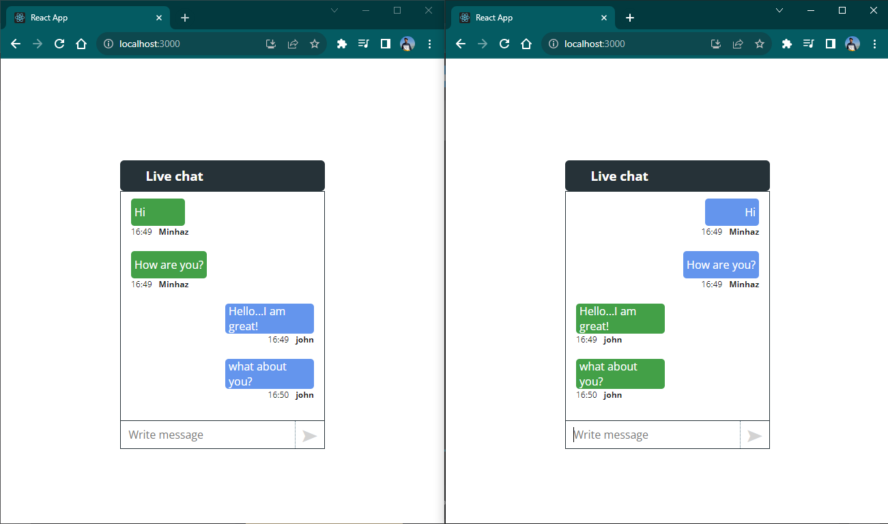

<h2>A simple chat application where user can join a chat-room by entering their name and the room Id and start coversation. I used react, nodeJS, express and Socket IO for this project.</h2>

<h3>Join a chat by entering your username and room id.</h3>

 
<h3>Enjoy conversation with others in the room.</h3>
